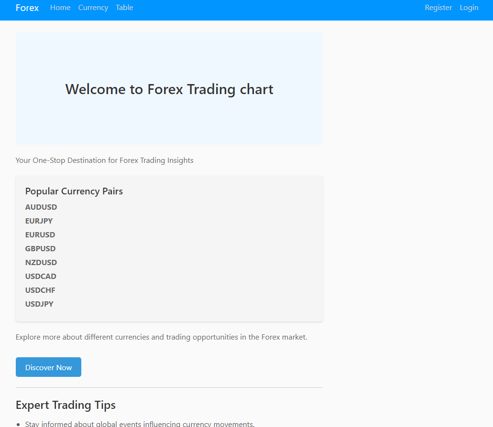
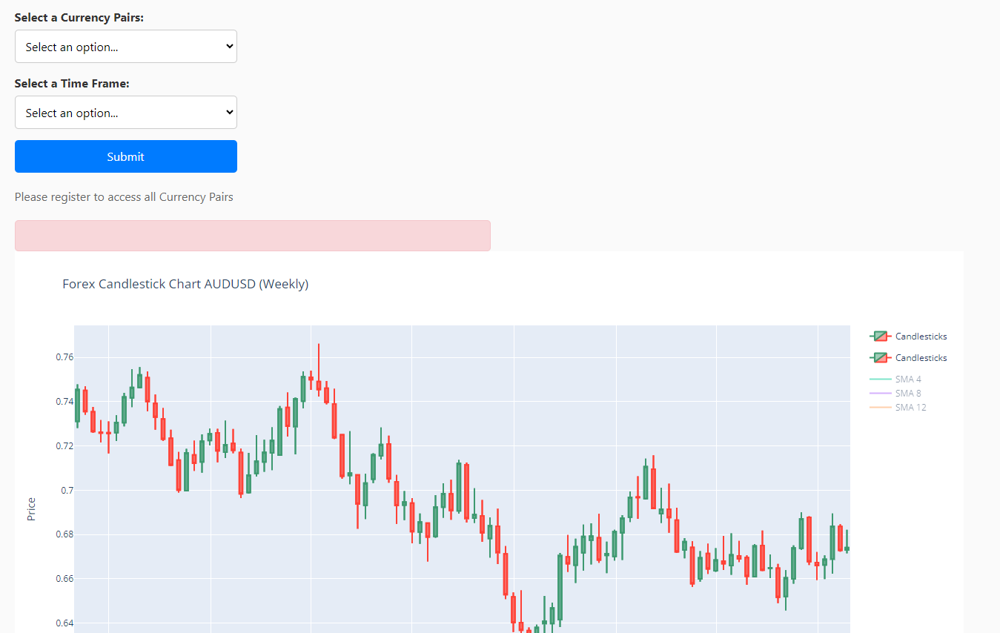
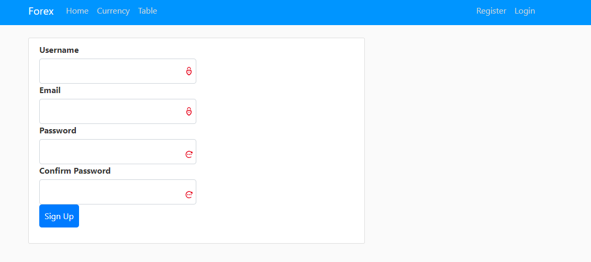
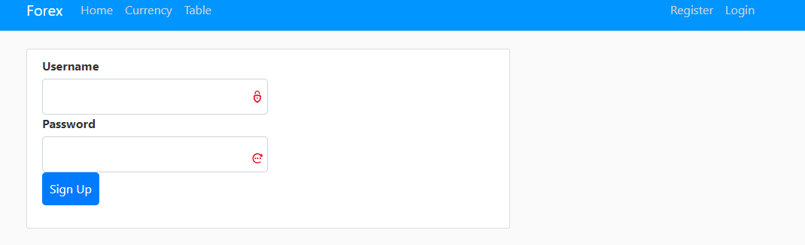
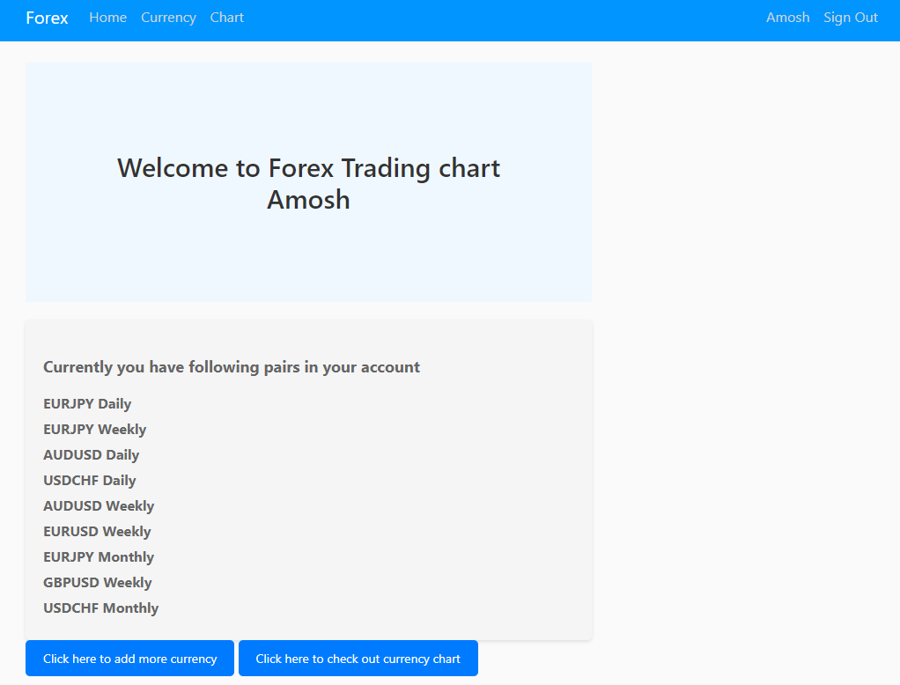
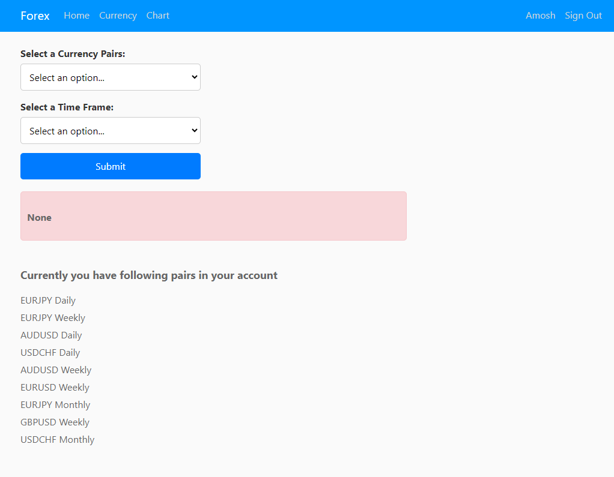
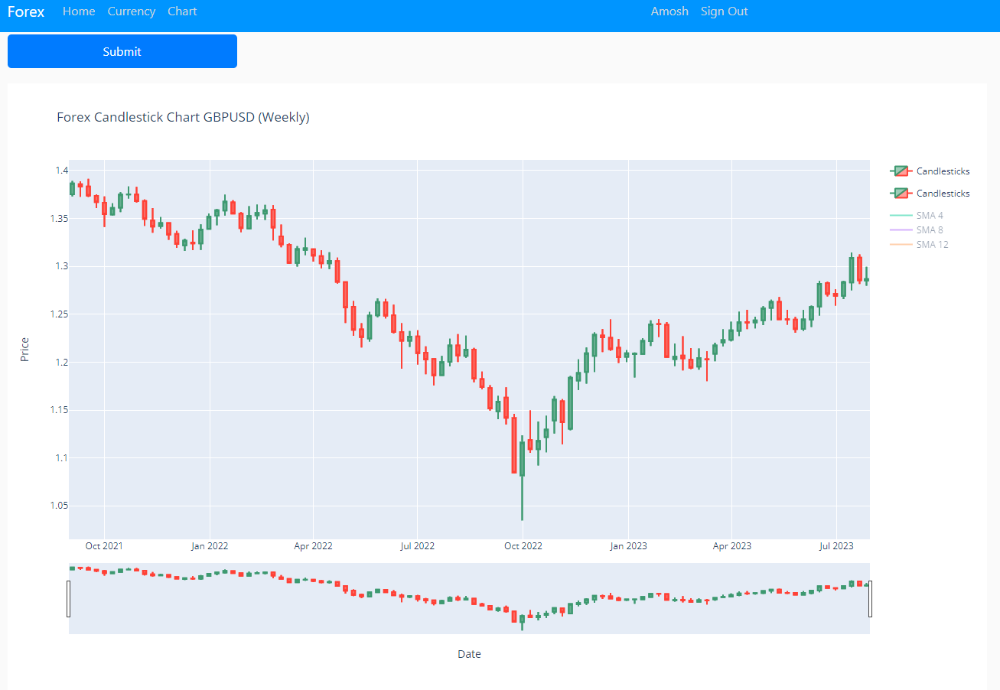
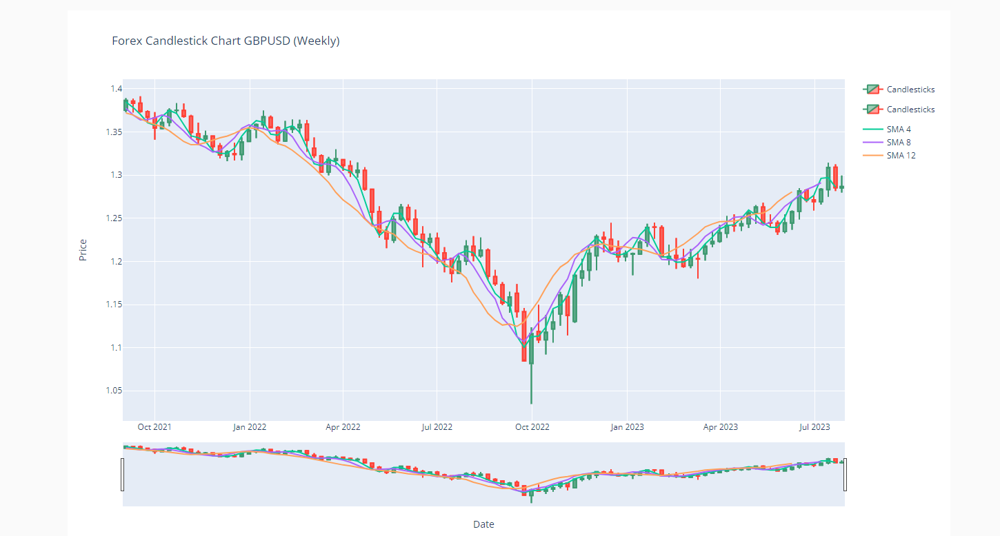

# Forex Trading Chart

The Forex Trading Chart Website is a web-based platform desgined to provide novice traders a set of features to gain better understanding of forex data. 
## Table of Contents

- [Introduction](#introduction)
- [Features](#features)
- - [Screenshots](#screenshots)
- [Getting Started](#getting-started)
  - [Prerequisites](#prerequisites)
  - [Installation](#installation)
- [Usage](#usage)

## Introduction 

The aim of this product is to assist novice forex traders in gaining a better understanding of forex data. By creating an account in the website, users can select the chart to analyze and add them to their account this feature help them to simplify and only focus on selected chart while they lean about forex data. 

The primary data employed in this product are the OHLC (Open, High, Low, and Close) values."Open" signifies the starting point of a trade, "High" represents the peak exchange rate reached during a specific timeframe, "Low" indicates the lowest exchange rate reached, and "Close" signifies the end of the trade within that timeframe.

## Features 

- **Candle Chart Display:**
            
    The core feature of the website is the display of candlestick charts for various currency pairs. Users can select different timeframes (e.g., Daily, Weekly, Monthly) to visualize the price movement over different periods. The website allows zooming in and out to focus on specific timeframes.

- **Registration and User Profiles:**
    
     A user registeration system that allows traders to access to view majority charts and to save favorite charts.

- **Technical Indicators (comming soon):**

    While the primary focus is on candlestick patterns, the website can include a limited set of essential technical indicators (e.g., moving averages, relative strength index) to assist traders in their analysis. The goal is to keep the focus on candlestick analysis while offering basic supplementary tools.

### Screenshots

#### Home page



#### Currency/Chart 



#### Register/Login 




#### UserPage



#### Select chart



#### Display chart


#### Simple moving average (SMA) indicator



## Getting Started

Please chick [here](https://amoshb.pythonanywhere.com/) to visit the website.

### Prerequisites

I reccommend to have Visual Studio Code, if user want to run website locally with python installed in their local machine.


### Installation 
1. **Clone the repository:**
    ```bash
    git@github.com:Amoshb/Seo_web2.git
2. **Open the Dictionary in Visual Studio Code:**
    ```bash
    cd Seo_web2
3. **Install requirements:**
    ```bash
    pip install -r requirements.txt
4. **Install any other extra module that is required using pip command**
    ```bash
    pip install "missing module"
5. **Run website.py**

Incase of updating forex data, users are required to have an api access key from [alphavantage](https://www.alphavantage.co/) and please follow the instruction on the Update_db.py file.

## Usage

When users visit the  [website](https://amoshb.pythonanywhere.com/), they are provided with a range of functionalities:. 

1. **Registration and Account Creation:** Users can kickstart their experience by registering and establishing an account. This enables them to safeguard their preferred charts and access personalized options.

2. **Currency Tab Display:** Upon arriving at the website, users encounter a demonstration chart featuring the AUD/USD currency pair. The chart showcases various timeframes: Daily, Weekly, and Monthly. This preview gives users a glimpse of the analytical capabilities our tools offer.

3. **Table Tab for Raw Data:** For those inclined toward in-depth analysis, the Table Tab showcases comprehensive raw data. This encompasses crucial details such as Date, Open, High, Low, and Close prices. This resource caters to individuals who prefer conducting their own analyses.

4. **Logging In and Currency Addition:** Once users log in, they can enhance their experience by incorporating currencies into their profiles. This step is pivotal in customizing the charts as per their preferences. The process is simple – users can either utilize the dedicated button or visit the Currency Tab. Once desired currencies are added, users are prepared for the subsequent step.

5. **Creating Currency Charts:** To visually interpret the added currency pairs, users can navigate to the Chart Tab or directly click the "Check Out Currency Chart" button. This section offers a selection of the added currencies. Users can choose their preferred currencies, submit their selection, and witness the transformation.

